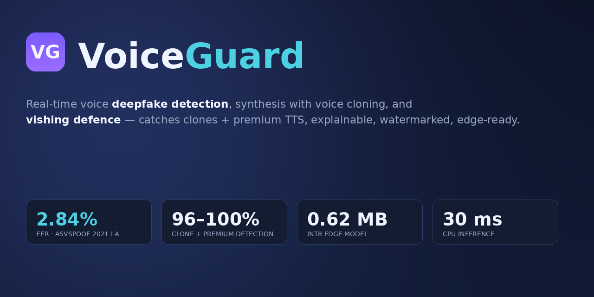
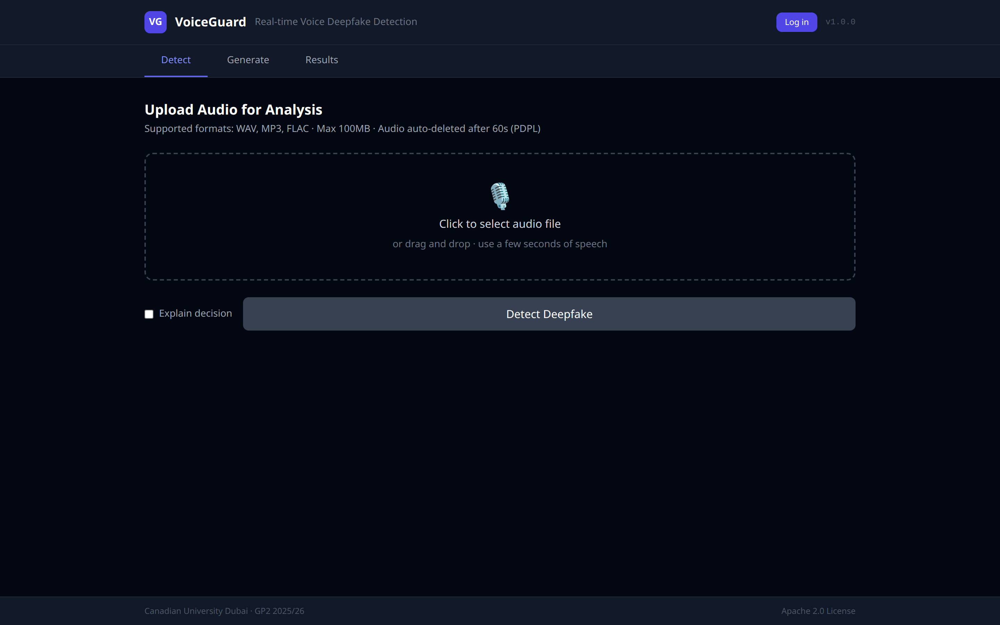
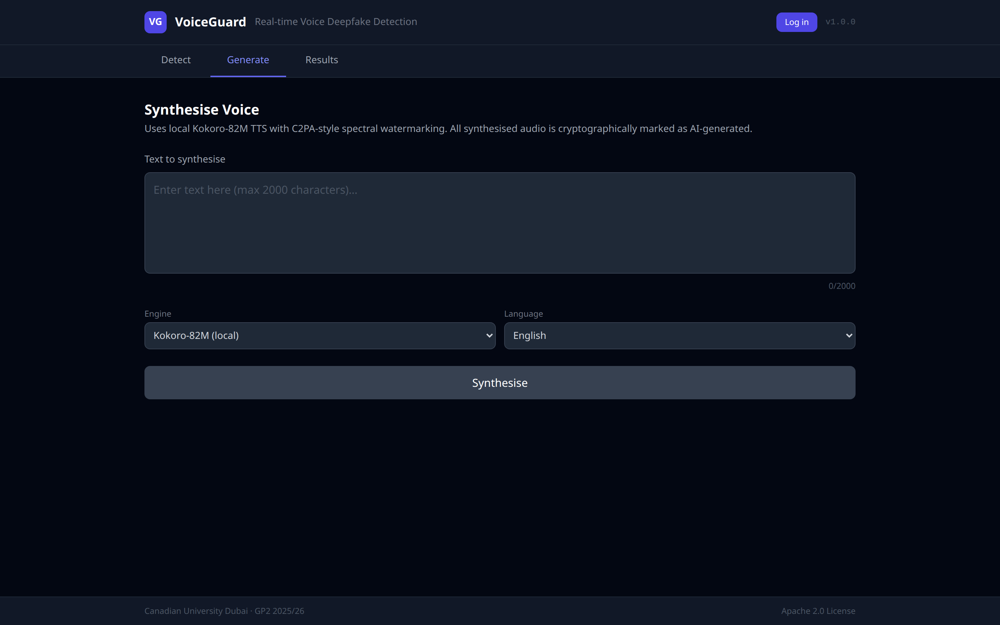
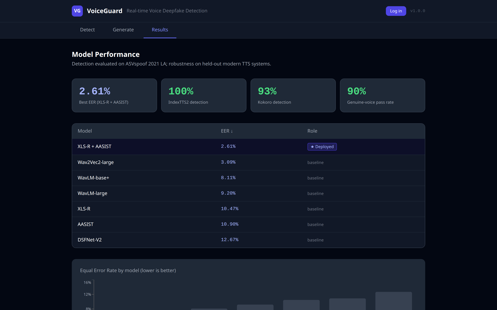
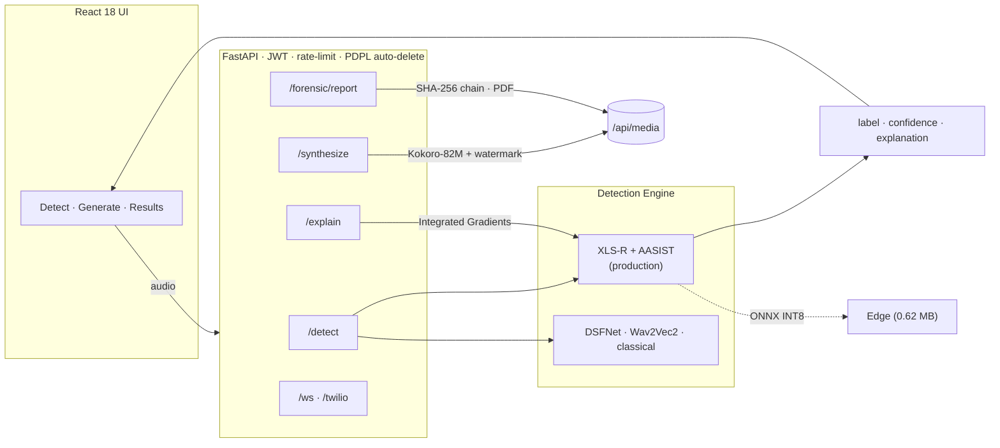

<div align="center">



# VoiceGuard

**Real-time voice deepfake detection, synthesis watermarking, and vishing defence.**

[](https://github.com/MohammadThabetHassan/VoiceGuard/actions/workflows/ci.yml)
[](LICENSE)
[](https://www.python.org)
[](https://fastapi.tiangolo.com)
[](https://react.dev)
[](https://pytorch.org)
[](https://github.com/astral-sh/ruff)
[](CONTRIBUTING.md)
[](#-citation)

<a href="#-quick-start">Quick start</a> ·
<a href="#-results">Results</a> ·
<a href="#-architecture">Architecture</a> ·
<a href="#-api">API</a> ·
<a href="CONTRIBUTING.md">Contributing</a>

</div>

---

## Why VoiceGuard?

AI voice cloning has turned phone fraud into a scalable weapon. In 2024 criminals
stole **US$25M** from a company using a deepfaked CFO on a video call, and reported
voice-phishing ("vishing") incidents **surged over 1,600%** in early 2025. Off-the-shelf
detectors collapse on *real-world* audio — phone codecs, background noise, and unseen
TTS engines — and offer no explanation a human analyst can act on.

**VoiceGuard** is an end-to-end platform that detects voice deepfakes in real time,
explains its decisions, watermarks any audio it generates, and ships small enough to
run at the edge. Built as a graduation project (GP2) at Canadian University Dubai; the
classical baseline was accepted at **IEEE SM2026**.

## ✨ Features

- 🛡️ **Detection** — production **XLS-R-300M + AASIST** model (official ASVspoof 2021 LA eval EER **2.84%**, v9c) that *also* catches modern voice clones and premium TTS, with DSFNet, Wav2Vec2/WavLM, and a classical XGBoost baseline all selectable. An input-quality guard rejects silent / too-short clips instead of guessing.
- 🌍 **Real-world robustness** — hardened against out-of-distribution TTS (Kokoro **93.3%**, IndexTTS2 **100%**) and noisy / telephony / short audio.
- 🎙️ **Live microphone streaming** — the web app's **Live tab** streams your mic over WebSocket and shows a rolling real/fake verdict every second (3s analysis window).
- 🔍 **Explainability** — Integrated-Gradients attribution shows *which moments* drove the verdict.
- 🗣️ **Synthesis + watermarking** — multi-engine Generate: local **Kokoro-82M** preset voices and optional **zero-shot voice cloning** (XTTS v2 / IndexTTS-2, admin-only) from a reference clip; every clip is spectrally watermarked as AI-generated and C2PA-signed. The **Verify tab** (`POST /watermark/verify`) closes the loop: prove any clip's provenance back. See [docs/SYNTHESIS_ENGINES.md](docs/SYNTHESIS_ENGINES.md).
- 🧾 **Forensics** — SHA-256 chain-of-custody and NIST SP 800-86 PDF reports.
- ☎️ **VoIP** — Twilio Media Streams bridge for live call screening.
- ⚡ **Edge-ready** — ONNX INT8 export at **0.62 MB**, **~30 ms** CPU inference.

## 🖼️ Screenshots

| Detect | Generate | Results |
|:------:|:--------:|:-------:|
|  |  |  |

## 🎬 Demo

End-to-end on the live deployment: log in → upload a **premium ElevenLabs clip → flagged 100% FAKE** (588 ms) → generate **watermarked** speech. Try it at **[voice-deepfake-vishing-detector-generator.eu.cc](https://voice-deepfake-vishing-detector-generator.eu.cc)**.


> Full-resolution clip: [`assets/demo.mp4`](assets/demo.mp4). Recorded with Playwright (`deploy/demo_record.py`).

## 📊 Results

**The deployed detector — XLS-R-300M + AASIST "v9c" — scores 2.84% EER on the official
ASVspoof 2021 LA eval (181,566 trials)**, and unlike EER-only checkpoints it *also*
catches what 2026 attackers actually use (speaker/text-disjoint held-out, 100/family):
real-pass **96%** · Kokoro **100%** · XTTS **100%** · IndexTTS-2 **97%** ·
**ElevenLabs-v3 (unseen) 95.8%**.

**Edge:** DSFNetTiny INT8 **0.62 MB**, CPU p50 **30 ms**, trained weights (8.47% EER).
**Provenance:** synthesized audio carries a real *signed C2PA manifest* + spectral watermark.

<details>
<summary><b>Model lineage — why you may spot other EERs (2.61 / 2.49 / 3.38) in this repo</b></summary>

| Model | EER (eval) | EER (full-pool) | Catches clones | Catches premium TTS | Role |
|-------|:----------:|:---------------:|:--------------:|:-------------------:|------|
| **XLS-R + AASIST — v9c** | **2.84%** | 8.21% | ✓ all ≥97% | ✓ ElevenLabs 96% | 🏆 **deployed** |
| XLS-R + AASIST — v7 | 3.38% | 8.60% | ✓ all ≥96.7% | ✗ (85%) | previous production |
| XLS-R + AASIST (Kokoro-parent) | 2.61% | 8.21% | ✗ | ✗ | EER-only headline |
| XLS-R + AASIST — v8 | 2.49% | 9.91% | ✗ (Kokoro 62.5%) | — | lowest official EER |
| Wav2Vec2-large | 3.09% | 7.07% | — | — | baseline |

**On the "2.61%".** That figure is the **Kokoro-parent** checkpoint on the official
eval — **reproduced exactly from raw FLAC on 2026-06-09** (`run_official_eval.py`) — but
it does *not* catch modern clones. The deployed lineage (v7 → v9c) is measured on the
same official protocol: **v7 = 3.38%**, **v9c = 2.84%**. v9c recovers most of the EER
gap *and* catches clones + premium TTS, so it's the best model overall. A lower official
EER (v8's 2.49%) was *rejected* for deployment because it is clone-blind.

</details>

> **🔬 Reproducible & honestly bounded.** Every EER carries a 95% bootstrap CI, on a
> single provenance-tagged table, with same-protocol baselines and a fixed env manifest —
> and the hard limits are *measured*, not hidden:
> [canonical results](docs/RESULTS_canonical.md) ·
> [adversarial/PGD curve](docs/ADVERSARIAL_ROBUSTNESS.md) ·
> [hidden-track analysis](docs/HIDDEN_TRACK_ANALYSIS.md) ·
> [clone-detection limits](docs/CLONE_DETECTION_LIMITS.md) ·
> [eval protocols & reproducibility](docs/EVAL_PROTOCOLS.md).

**🌐 Live demo:** https://voice-deepfake-vishing-detector-generator.eu.cc

## 🏗️ Architecture



## 🚀 Quick start

```bash
git clone https://github.com/MohammadThabetHassan/VoiceGuard.git
cd VoiceGuard

# Backend (Python 3.12)
python3 -m venv venv && source venv/bin/activate
pip install -e .

PYTHONPATH=src SECRET_KEY="$(openssl rand -hex 32)" \
  uvicorn voiceguard.api.main:app --host 127.0.0.1 --port 8000
# API docs → http://127.0.0.1:8000/docs   (demo login: admin / voiceguard2026)

# Frontend (in another shell)
cd frontend && npm ci && npm run dev
```

The production detector (`xls_r_aasist`) needs a ~1.2 GB checkpoint (not in git);
without it, set `model=classical` or point `XLS_R_AASIST_PATH` at the checkpoint.
Self-hosted deployment (Nginx + systemd) is scripted in [`deploy/`](deploy/).
Docker Compose is also provided: `docker compose up --build` serves everything on
`http://localhost`, mounts `./checkpoints` into the backend (drop the checkpoint at
`checkpoints/xls_r_aasist/model_best.pt` or export `XLS_R_AASIST_PATH`), and falls
back to the classical baseline when no checkpoint is present.

### Three ways to run it

| Mode | What | Install |
|------|------|---------|
| 🌐 **Web app / API** | Full SSL model **v9c** (catches clones + premium); live demo + REST API | this Quick start, or the [live demo](https://voice-deepfake-vishing-detector-generator.eu.cc) |
| 🔬 **IPED forensic add-on** | Flags deepfake audio inside the [IPED](https://github.com/sepinf-inc/IPED) evidence pipeline (a capability IPED lacks) | [`integrations/iped/`](integrations/iped/) |
| 🍓 **Raspberry Pi / edge** | 0.62 MB INT8 model, CPU-only, `onnxruntime`+`numpy`+`soundfile` (no torch) | [`edge/`](edge/) |

## 🔌 API

| Method | Endpoint | Description | Auth |
|--------|----------|-------------|:----:|
| `POST` | `/token` | OAuth2 password → JWT (carries a `role` claim) | — |
| `POST` | `/detect` | Audio → verdict (`?model=`, `?explain=true`) | 🔑 |
| `POST` | `/explain` | Integrated-Gradients attribution | 🔑 |
| `POST` | `/synthesize` | Text → watermarked speech (voice *cloning* is admin-only + quota'd) | 🔑 |
| `POST` | `/watermark/verify` | Provenance check: spectral watermark + C2PA manifest | 🔑 |
| `POST` | `/forensic/report` | NIST SP 800-86 PDF report (audio metadata, model + checkpoint hash) | 🔑 |
| `WS` | `/ws/stream` | Live-mic streaming (JWT as first WS message; capped slots) | 🔑 |
| `WS` | `/twilio/stream` | Twilio call screening (`X-Twilio-Signature` when `TWILIO_AUTH_TOKEN` set) | ✍️ |
| `GET` | `/models` · `/health` · `/docs` | Ops & Swagger | — |

🔑 JWT bearer · ✍️ Twilio request signature (open in development; refused in
production unless `TWILIO_AUTH_TOKEN` is configured)

## 🛠️ Tech stack

**ML** PyTorch · transformers (XLS-R, Wav2Vec2, WavLM) · AASIST · XGBoost · captum · ONNX Runtime
· **Backend** FastAPI · python-jose (JWT) · slowapi · **Frontend** React 18 · Vite · Tailwind · Recharts
· **Audio** librosa · torchaudio · Kokoro-82M · **Infra** Nginx + systemd · Docker · GitHub Actions · ruff · bandit

## 🗺️ Roadmap

- [x] Train `DSFNetTiny` so the ONNX edge export carries accuracy
- [x] Reproduce the official ASVspoof 2021 LA 2.61% EER
- [x] True signed C2PA provenance on synthesized audio
- [x] Permanent hosted demo (custom domain via Cloudflare Tunnel)
- [ ] Premium-TTS (ElevenLabs) hardening with a real-pass safety gate (in progress)
- [ ] Backbone adversarial fine-tuning for true PGD robustness
- [ ] GADC (Gulf-Arabic Deepfake Corpus) + human perception study

## 🤝 Contributing

Contributions welcome — see [CONTRIBUTING.md](CONTRIBUTING.md) and our
[Code of Conduct](CODE_OF_CONDUCT.md). For vulnerabilities, see [SECURITY.md](SECURITY.md).

## 👥 Team

| Name | Role |
|------|------|
| **Mohammad Thabet Hassan** | Detection architecture, FastAPI backend, CI/CD, deployment |
| **Fahad Sadek Al-Jazzeri** | Feature extraction, classical ML, SSL models, evaluation |
| **Ahmed Sami Alameri** | React frontend, synthesis, watermarking, VoIP, forensics, XAI |

**Supervisor:** [Dr. Arash Kermani Kolankeh](https://github.com/arashkermaniprojects) · **Institution:** Canadian University Dubai · **2025–2026**

## 🙏 Acknowledgements

A heartfelt **thank you to our supervisor, [Dr. Arash Kermani Kolankeh](https://github.com/arashkermaniprojects)**,
whose guidance, insight, and encouragement shaped VoiceGuard at every stage. This project
would not have been possible without his mentorship — thank you, Dr. Arash.

## 📚 Citation

The **IEEE SM2026 acceptance covers the GP1 classical-baseline paper** (feature-based
detection, F1 = 0.95) — not the full platform or the XLS-R+AASIST results in this
repository, which post-date the submission. If you cite the accepted work:

```bibtex
@inproceedings{voiceguard2026,
  title     = {VoiceGuard: Real-Time Voice Deepfake Detection and Adversarial
               Speech Synthesis with Explainable AI},
  author    = {Hassan, Mohammad Thabet and Al-Jazzeri, Fahad Sadek and Alameri, Ahmed Sami},
  booktitle = {Proceedings of IEEE SM2026},
  year      = {2026},
  organization = {Canadian University Dubai},
  note      = {Accepted paper covers the classical baseline; the deployed
               XLS-R+AASIST detector is described in this repository}
}
```

## 📄 License

[Apache License 2.0](LICENSE).
