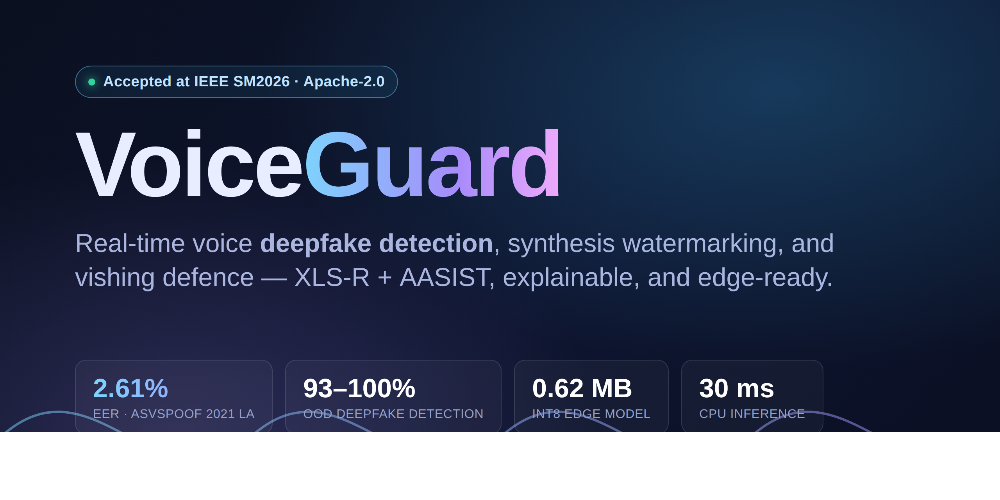
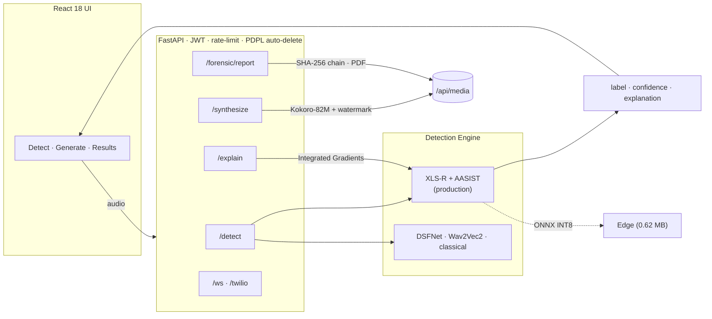

<div align="center">



# VoiceGuard

**Real-time voice deepfake detection, synthesis watermarking, and vishing defence.**

[](https://github.com/MohammadThabetHassan/VoiceGuard/actions/workflows/ci.yml)
[](LICENSE)
[](https://www.python.org)
[](https://fastapi.tiangolo.com)
[](https://react.dev)
[](https://pytorch.org)
[](https://github.com/astral-sh/ruff)
[](CONTRIBUTING.md)
[](#-results)

<a href="#-quick-start">Quick start</a> ·
<a href="#-results">Results</a> ·
<a href="#-architecture">Architecture</a> ·
<a href="#-api">API</a> ·
<a href="CONTRIBUTING.md">Contributing</a>

</div>

---

## Why VoiceGuard?

AI voice cloning has turned phone fraud into a scalable weapon. In 2024 criminals
stole **US$25M** from a company using a deepfaked CFO on a video call, and reported
voice-phishing ("vishing") incidents **surged over 1,600%** in early 2025. Off-the-shelf
detectors collapse on *real-world* audio — phone codecs, background noise, and unseen
TTS engines — and offer no explanation a human analyst can act on.

**VoiceGuard** is an end-to-end platform that detects voice deepfakes in real time,
explains its decisions, watermarks any audio it generates, and ships small enough to
run at the edge. Built as a graduation project (GP2) at Canadian University Dubai; the
classical baseline was accepted at **IEEE SM2026**.

## ✨ Features

- 🛡️ **Detection** — production **XLS-R-300M + AASIST** model (eval EER **2.61%**), with DSFNet, Wav2Vec2/WavLM, and a classical XGBoost baseline all selectable. An input-quality guard rejects silent / too-short clips instead of guessing.
- 🌍 **Real-world robustness** — hardened against out-of-distribution TTS (Kokoro **93.3%**, IndexTTS2 **100%**) and noisy / telephony / short audio.
- 🔍 **Explainability** — Integrated-Gradients attribution shows *which moments* drove the verdict.
- 🗣️ **Synthesis + watermarking** — local **Kokoro-82M** TTS that spectrally watermarks every clip as AI-generated.
- 🧾 **Forensics** — SHA-256 chain-of-custody and NIST SP 800-86 PDF reports.
- ☎️ **VoIP** — Twilio Media Streams bridge for live call screening.
- ⚡ **Edge-ready** — ONNX INT8 export at **0.62 MB**, **~30 ms** CPU inference.

## 🖼️ Screenshots

| Detect | Generate | Results |
|:------:|:--------:|:-------:|
|  |  |  |

## 📊 Results

Trained on ASVspoof 2019 LA, evaluated on the full ASVspoof 2021 LA set (181,566 trials).

| Model | EER (eval) | EER (full-pool) | Role |
|-------|:----------:|:---------------:|------|
| **XLS-R + AASIST** (Kokoro-hardened) | **2.61%** | 8.21% | 🏆 headline |
| Wav2Vec2-large | 3.09% | 7.07% | baseline |
| WavLM-base-plus | 8.11% | — | baseline |
| AASIST | 10.90% | — | baseline |
| DSFNet-V2 | — | 12.67% | own architecture |

**Out-of-distribution & real-world:** IndexTTS2 100% · Kokoro 93.3% · genuine-voice
pass-rate 90% · real-world harness real-pass **87.5%** / fake-detect **90.3%**.
**Edge:** DSFNetTiny INT8 **0.62 MB**, CPU p50 **30 ms**.

> **Honest note.** The deployed checkpoint is a real-world-robustness fine-tune of the
> 2.61% Kokoro-hardened model; its ASVspoof EER was not separately benchmarked. PGD
> adversarial hardening is documented as a *negative result* (see [CHANGELOG](CHANGELOG.md)).
> The ONNX export validates size/latency with random weights (no trained tiny model yet).

## 🏗️ Architecture



## 🚀 Quick start

```bash
git clone https://github.com/MohammadThabetHassan/VoiceGuard.git
cd VoiceGuard

# Backend (Python 3.12)
python3 -m venv venv && source venv/bin/activate
pip install -e .

PYTHONPATH=src SECRET_KEY="$(openssl rand -hex 32)" \
  uvicorn voiceguard.api.main:app --host 127.0.0.1 --port 8000
# API docs → http://127.0.0.1:8000/docs   (demo login: admin / voiceguard2026)

# Frontend (in another shell)
cd frontend && npm ci && npm run dev
```

The production detector (`xls_r_aasist`) needs a ~1.2 GB checkpoint (not in git);
without it, set `model=classical` or point `XLS_R_AASIST_PATH` at the checkpoint.
Self-hosted deployment (Nginx + systemd) is scripted in [`deploy/`](deploy/);
Docker Compose is also provided.

## 🔌 API

| Method | Endpoint | Description | Auth |
|--------|----------|-------------|:----:|
| `POST` | `/token` | OAuth2 password → JWT | — |
| `POST` | `/detect` | Audio → verdict (`?model=`, `?explain=true`) | 🔑 |
| `POST` | `/explain` | Integrated-Gradients attribution | 🔑 |
| `POST` | `/synthesize` | Text → watermarked Kokoro speech | 🔑 |
| `POST` | `/forensic/report` | NIST SP 800-86 PDF report | 🔑 |
| `WS` | `/ws/stream` · `/twilio/stream` | Live mic / Twilio call screening | 🔑 |
| `GET` | `/models` · `/health` · `/docs` | Ops & Swagger | — |

## 🛠️ Tech stack

**ML** PyTorch · transformers (XLS-R, Wav2Vec2, WavLM) · AASIST · XGBoost · captum · ONNX Runtime
· **Backend** FastAPI · python-jose (JWT) · slowapi · **Frontend** React 18 · Vite · Tailwind · Recharts
· **Audio** librosa · torchaudio · Kokoro-82M · **Infra** Nginx + systemd · Docker · GitHub Actions · ruff · bandit

## 🗺️ Roadmap

- [ ] Train `DSFNetTiny` so the ONNX edge export carries accuracy
- [ ] Backbone adversarial fine-tuning for true PGD robustness
- [ ] GADC (Gulf-Arabic Deepfake Corpus) + human perception study
- [ ] Permanent hosted demo

## 🤝 Contributing

Contributions welcome — see [CONTRIBUTING.md](CONTRIBUTING.md) and our
[Code of Conduct](CODE_OF_CONDUCT.md). For vulnerabilities, see [SECURITY.md](SECURITY.md).

## 👥 Team

| Name | Role |
|------|------|
| **Mohammad Thabet Hassan** | Detection architecture, FastAPI backend, CI/CD, deployment |
| **Fahad Sadek Al-Jazzeri** | Feature extraction, classical ML, SSL models, evaluation |
| **Ahmed Sami Alameri** | React frontend, synthesis, watermarking, VoIP, forensics, XAI |

**Supervisor:** Dr. Arash Kermani Kolankeh · **Institution:** Canadian University Dubai · **2025–2026**

## 📚 Citation

```bibtex
@inproceedings{voiceguard2026,
  title     = {VoiceGuard: Real-Time Voice Deepfake Detection and Adversarial
               Speech Synthesis with Explainable AI},
  author    = {Hassan, Mohammad Thabet and Al-Jazzeri, Fahad Sadek and Alameri, Ahmed Sami},
  booktitle = {Proceedings of IEEE SM2026},
  year      = {2026},
  organization = {Canadian University Dubai}
}
```

## 📄 License

[Apache License 2.0](LICENSE).
